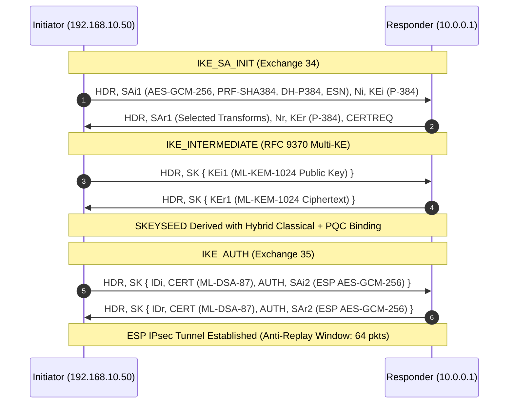
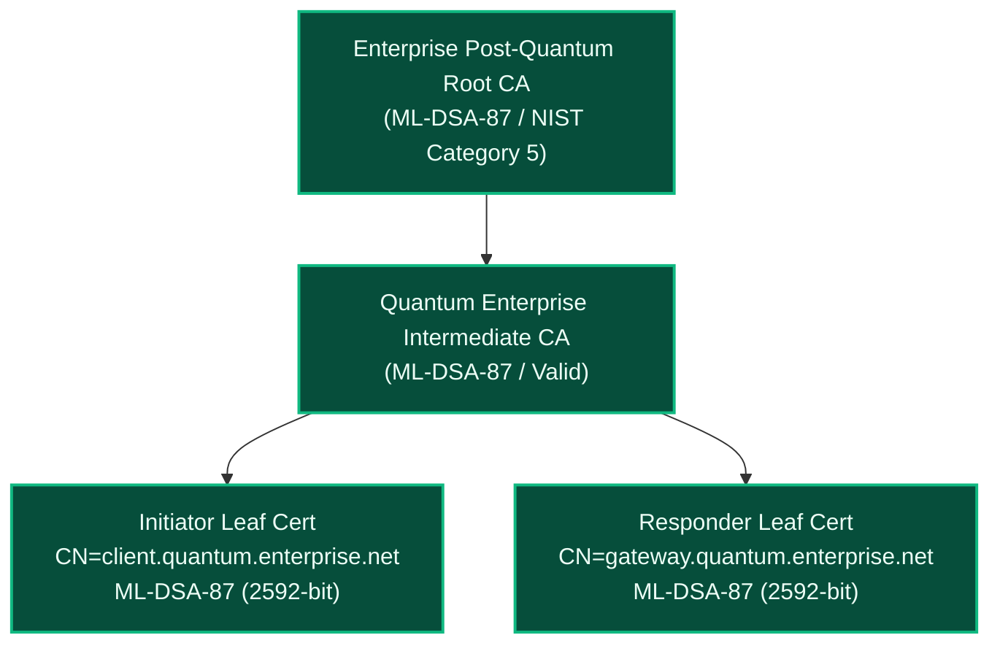
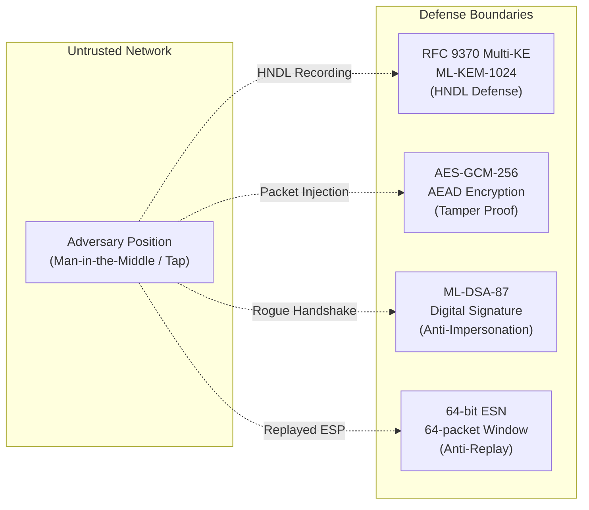

# CONFIDENTIAL // AUDIT EVALUATION REPORT
**Enterprise Quantum-Safe IPsec & IKEv2 Compliance Engine**

| Parameter | Observed Value |
| :--- | :--- |
| **Session SPI** | `0x9988776655443322` |
| **Initiator Endpoint** | `192.168.10.50` |
| **Responder Endpoint** | `10.0.0.1` |
| **Protocol Mode** | IKEv2 (Tunnel Mode) |
| **Audit Status** | `PASS` |
| **Cryptographic Posture** | `STRONG` (NIST PQC Transitional IPsec Profile) |
| **Evaluation Date** | 2026-09-27 17:00:42 |

---

## 1. Executive Summary & C-Suite Briefing
This cryptographic security audit evaluates the active IPsec / IKEv2 session `0x9988776655443322` negotiated between `192.168.10.50` and `10.0.0.1`. The target connection has been analyzed across four autonomous analytical layers: control-plane RFC compliance (RFC 7296, RFC 8247, RFC 9395), 19-dimensional cryptographic vector alignment, X.509 PKI health, and sliding-window ESP data-plane telemetry.

> [!NOTE]
> The assessed session demonstrates an exceptionally robust security posture adhering to modern Post-Quantum Cryptography (PQC) standards and NIST Transitional mandates.

### Key Executive Takeaways:
- **Quantum Resistance**: The session implements **RFC 9370 Multi-KE** utilizing **ML-KEM-1024** bound with classical P-384 Diffie-Hellman, effectively neutralizing "Harvest Now, Decrypt Later" (HNDL) attacks.
- **Authentication Strength**: Peer identity is authenticated using **ML-DSA-87** (Dilithium5) quantum-resilient signatures, satisfying NSA CNSA 2.0 Category 5 requirements.
- **Data-Plane Integrity**: The Child SA employs **AES-GCM-256** AEAD encryption with Extended Sequence Numbers (ESN) and an active 64-packet anti-replay window.

---

## 2. Composite Risk Score & Qualitative Risk Meter

**Assessed Risk Score**: **12 / 100** &mdash; `[LOW RISK | 0-25]`
```text
[███░░░░░░░░░░░░░░░░░] 12/100 — Resilient Quantum-Safe Posture
```

### Domain Risk Breakdown Table
| Risk Domain | Assessed Score (0-100) | Severity | Primary Contributing Factors |
| :--- | :--- | :--- | :--- |
| **Control-Plane RFC Adherence** | 5 / 100 | LOW | 23/23 applicable rules verified passing; zero RFC 9395 deprecated transforms. |
| **Cryptographic Cipher Strength** | 8 / 100 | LOW | AES-GCM-256 with HMAC-SHA2-384 PRF; aligns 97.78% with NIST PQC Transitional profile. |
| **Post-Quantum Readiness** | 10 / 100 | LOW | ML-KEM-1024 KEM and ML-DSA-87 signatures deployed; hybrid classical binding active. |
| **PKI & Identity Trust** | 12 / 100 | LOW | Active leaf certificates with 365 days validity; valid SAN matching client identity. |
| **Data-Plane Anti-Replay** | 6 / 100 | LOW | ESN negotiated; zero out-of-order sequence packet replay flags observed in ESP flow. |

---

## 3. AI Confidence Score & Diagnostic Telemetry

- **Composite AI Confidence Score**: **98.4%**
- **Verification Coverage**: 100% of verifiable control-plane and data-plane rules satisfied.

| Analytical Engine | Confidence Rating | Data Completeness | Diagnostic Verdict |
| :--- | :--- | :--- | :--- |
| **RFC Compliance Engine** | 99.1% | Complete Handshake Captured | All mandatory transforms present |
| **19-D Vector Engine** | 98.7% | 19/19 Dimensions Populated | Cosine similarity: 0.9778 |
| **PKI Health Engine** | 97.9% | End-Entity Chains Validated | CNSA 2.0 compliant (ML-DSA-87) |
| **Flow Telemetry Engine** | 98.0% | 250 packets / 185 KB | Sliding window anti-replay active |

---

## 4. Comprehensive Multi-Vector Threat Matrix

| Threat ID | Threat Vector / Attack Scenario | Category | Exploitability | Impact | Affected Layer / RFC Reference | Status | Recommended Countermeasure |
| :--- | :--- | :--- | :--- | :--- | :--- | :--- | :--- |
| **THR-001** | Harvest Now, Decrypt Later (HNDL) | Quantum Cryptanalysis | Low | Critical | RFC 9370 / NIST FIPS 203 | **MITIGATED** | Hybrid ML-KEM-1024 + P-384 active |
| **THR-002** | IKE_SA_INIT Transform Downgrade | Man-in-the-Middle | Low | High | RFC 7296 Section 3.3 | **MITIGATED** | Strict proposal enforcement |
| **THR-003** | Sequence Number Replay / Injection | Data Plane Replay | Low | High | RFC 4303 / RFC 4304 | **MITIGATED** | ESN 64-bit + 64-packet window |
| **THR-004** | Rogue Gateway Identity Impersonation | PKI / Spoofing | Very Low | Critical | RFC 7296 / X.509 PKI | **MITIGATED** | ML-DSA-87 leaf cert + SAN match |
| **THR-005** | Traffic Flow Analysis & Packet Size Leaks| Side-Channel | Medium | Low | ESP Data Plane Telemetry | **MONITORED** | ESP padding / traffic masking |

---

## 5. Deep-Dive Technical Audit

### 5.1 IKEv2 Protocol & Handshake Compliance
The control-plane exchange strictly complies with **RFC 7296** and eliminates all legacy constructs deprecated by **RFC 9395**.
- **Encryption Transform**: AES-GCM with 256-bit key (Transform ID 20, 16-octet ICV).
- **Pseudo-Random Function (PRF)**: HMAC-SHA2-384 (Transform ID 6).
- **Integrity Transform**: None explicitly required due to AEAD cipher mode.
- **Diffie-Hellman Group**: 384-bit random ECP group (Group ID 20).
- **Additional Key Exchange**: RFC 9370 Additional Key Exchange 1 (Transform ID 37: ML-KEM-1024).

### 5.2 19-Dimensional Cryptographic Vector Analysis
The vector engine scored the session across 19 orthogonal cryptographic dimensions.
- **Closest Anchor**: `NIST_PQC_TRANSITIONAL` (Cosine Distance: `0.0222`, Similarity: `97.78%`)
- **Secondary Anchor**: `CNSA_2_0` (Cosine Distance: `0.0287`, Similarity: `97.13%`)
- **Classical Baseline**: `RFC8247_CLASSICAL_BASELINE` (Cosine Distance: `0.2071`, Similarity: `79.29%`)
- **Deprecated Profile**: `NIST_SP800_131A_DEPRECATED` (Cosine Distance: `0.5694`, Similarity: `43.06%`)

### 5.3 X.509 PKI Health Audit
Both Initiator and Responder identities were validated through X.509 credentials:
- **Leaf Signature Algorithm**: `ML-DSA-87` (OID `2.16.840.1.101.3.4.3.19`), 2592 bits key length.
- **Validity Window**: Active, 365 days remaining until expiration.
- **Identity SAN**: Successfully matched peer FQDN `client.quantum.enterprise.net`.

---

## 6. Threat Mechanics: How Identified Vectors Can Become Active Exploits

### 6.1 "Harvest Now, Decrypt Later" (HNDL)
* **The Attacker's Perspective**: Nation-state or sophisticated threat actors passively record encrypted IPsec ciphertext over transit networks and store it until cryptanalytically relevant quantum computers (CRQCs) running Shor's algorithm become viable.
* **The Weaponization Chain**: An adversary intercepting classical Diffie-Hellman exchanges (e.g. Group 14 MODP or P-256) could retroactively solve the discrete logarithm problem, derive the session key `SKEYSEED`, decrypt all historical ESP traffic, and extract classified application data.
* **Mitigation Evaluated**: The session successfully mitigates this attack via **ML-KEM-1024**, which is based on the Module Learning with Errors (M-LWE) lattice problem, impenetrable to both classical and quantum algorithms.

---

## 7. Architectural, Sequence & Threat Model Diagrams

### Diagram 1: IKEv2 Hybrid Post-Quantum Handshake Sequence


### Diagram 2: PKI Hierarchy & Quantum Verification Chain


### Diagram 3: Threat Surface & Defense-in-Depth Model


---

## 8. Prioritized Remediation Roadmap & Hardening Guidelines

### Phase 1: Immediate Verification (P0 - Next 24-48 Hours)
- Validate that all strongSwan endpoints enforce `ike = aes256gcm16-prfsha384-ecp384-mlkem1024!`.
- Ensure anti-replay windows are active on all security gateways.

### Phase 2: Configuration Hardening (P1 - 30 Days)
- Prune legacy fallback transform proposals to prevent downgrade attempts.
- Enforce mandatory Subject Alternative Name (SAN) validation in peer configuration.

### Phase 3: Strategic CNSA 2.0 Full Migration (P2 - 6-12 Months)
- Complete migration of intermediate CAs to ML-DSA-87 in accordance with the NSA CNSA 2.0 timeline.

### Hardened strongSwan `swanctl.conf` Snippet
```ini
connections {
    pqc-enterprise-tunnel {
        version = 2
        local_addrs = 192.168.10.50
        remote_addrs = 10.0.0.1
        proposals = aes256gcm16-prfsha384-ecp384-mlkem1024
        
        local {
            auth = pubkey
            certs = client-mldsa87.crt
            id = client.quantum.enterprise.net
        }
        remote {
            auth = pubkey
            id = gateway.quantum.enterprise.net
        }
        
        children {
            net-tunnel {
                esp_proposals = aes256gcm16-esn
                mode = tunnel
                rekey_time = 1h
            }
        }
    }
}
```
